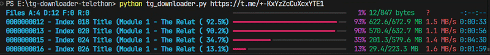

# Telegram Bulk Media Downloader (Telethon)

A reliable Telegram channel media archiver built for students and learners who study from Telegram channels but struggle to save, organize, and watch course content offline.

In India and elsewhere, many students rely on Telegram for courses, notes, and video lectures. Scrolling through long channel histories, dealing with slow playback, and losing access when channels change is frustrating. This tool downloads **images, audio, video, and documents** (PDF, Word, Excel, PowerPoint, ZIP, text files, and more) from channels in order, with **resume support**, so you can study offline with VLC or any reader.

**Best case throughput:** about **10–15 MB/s** (depends on your ISP, Telegram CDN, Windows Defender, SSD, and tuning). Typical speeds are lower; see [Speed tuning](#speed-tuning) below.

## Demo

Live terminal progress while downloading a channel (multipart + multi-file concurrency):



---

## Features

- Download from public channels, `t.me` links, and invite links
- Media types: images, audio, video, **PDF**, Office files, **ZIP/RAR/7z/tar.gz** and other archives, text/CSV, and more
- Chronological numbering: `0000000001 - caption.mp4`
- Caption-based filenames (ASCII-safe, Windows path limits respected)
- Resume: skips already completed files via `manifest.json`
- Multipart segmented downloads for large files
- Retries, FloodWait handling, integrity checks
- Live progress (Rich multi-line dashboard when installed)

**Not downloaded:** stickers, webpage previews (link-only posts).

---

## Requirements

- **Windows 10/11** (primary target), or Linux/macOS
- **Python 3.11+** (3.12 recommended)
- Telegram account + API credentials from [my.telegram.org/apps](https://my.telegram.org/apps)
- SSD recommended for large video channels

---

## Quick start

### 1. Clone or download this project

```powershell
cd E:\tg-downloader-telethon
```

### 2. Create a virtual environment (recommended)

```powershell
python -m venv .venv
.\.venv\Scripts\Activate.ps1
pip install -r requirements.txt
```

### 3. Configure environment

```powershell
copy .env.example .env
```

Edit `.env` and set at minimum:

| Variable | Description |
|----------|-------------|
| `TG_API_ID` | Numeric app id from my.telegram.org |
| `TG_API_HASH` | Api hash from my.telegram.org |

### 4. First run (login once)

```powershell
python tg_downloader.py https://t.me/your_channel_username
```

On first run you will be asked for:

1. Phone number (with country code, e.g. `+91...`)
2. OTP code from Telegram
3. Two-step password (only if enabled on your account)

A session file (e.g. `tg_downloader.session`) is saved so you do not need to log in every time.

### 5. Downloads location

Files are saved under:

```text
downloads/<Channel Name>/
  0000000001 - lesson title.mp4
  0000000002 - another lesson.mp4
  manifest.json
```

Re-running the same channel **continues** where you left off; completed files are skipped.

---

## Usage examples

**Public channel by username or link:**

```powershell
python tg_downloader.py https://t.me/SANKET_LAMBDA4
```

**Multiple channels (one after another):**

```powershell
python tg_downloader.py https://t.me/channel_one https://t.me/channel_two
```

**Private invite link:**

```powershell
python tg_downloader.py https://t.me/+YourInviteHash
```

---

## Environment variables

See [`.env.example`](.env.example) for a full template with comments.

| Variable | Default | Purpose |
|----------|---------|---------|
| `TG_API_ID` | — | **Required** Telegram API id |
| `TG_API_HASH` | — | **Required** Telegram API hash |
| `TG_SESSION_NAME` | `tg_downloader` | Session file base name |
| `TG_CONCURRENCY` | `1` | Parallel file downloads |
| `TG_MAX_GLOBAL_DOWNLOADS` | (same as concurrency) | Overrides concurrency if set |
| `TG_MAX_RETRIES` | `5` | Retries per file |
| `TG_DOWNLOAD_DELAY` | `0` | Seconds before each file |
| `TG_OUTPUT_DIR` | `downloads` | Output root folder |
| `TG_REQUEST_SIZE_BYTES` | `2097152` | Chunk size for streaming |
| `TG_MANIFEST_FLUSH_FILES` | `20` | Save manifest every N files |
| `TG_MANIFEST_FLUSH_SECONDS` | `30` | Save manifest every N seconds |
| `TG_PROGRESS_UPDATE_SEC` | `1.5` | UI refresh interval |
| `TG_ENABLE_MULTIPART` | `true` | Parallel parts per large file |
| `TG_PART_SIZE_MB` | `8` | Size of each part (MB) |
| `TG_MAX_PARALLEL_PARTS` | `4` | Concurrent parts per file |
| `TG_MERGE_BUFFER_MB` | `16` | Buffer when merging parts |

---

## Speed tuning

Telegram rate-limits aggressive downloaders. More parallel workers is not always faster.

**Stable (recommended start):**

```env
TG_MAX_GLOBAL_DOWNLOADS=2
TG_DOWNLOAD_DELAY=0
TG_ENABLE_MULTIPART=true
TG_PART_SIZE_MB=8
TG_MAX_PARALLEL_PARTS=4
TG_REQUEST_SIZE_BYTES=2097152
```

**Aggressive (higher risk of FloodWait; best on SSD + Defender exclusions):**

```env
TG_MAX_GLOBAL_DOWNLOADS=2
TG_PART_SIZE_MB=16
TG_MAX_PARALLEL_PARTS=6
TG_REQUEST_SIZE_BYTES=4194304
```

**Also install `cryptg`** (included in `requirements.txt`) for faster encryption:

```powershell
pip install cryptg
```

### Windows tips for 10–15 MB/s

1. Save to an **SSD**, not HDD/USB.
2. Add **Windows Defender exclusions** for:
   - This project folder
   - `downloads\`
   - Your Python / `.venv` folder
3. Use **Ethernet** or strong 5 GHz Wi‑Fi; avoid VPN if possible.
4. Keep **one downloader session** running at a time.

Realistic ranges:

| Setup | Typical speed |
|-------|----------------|
| Basic / HDD / high concurrency | 0.5–2 MB/s |
| Tuned sequential + cryptg | 2–4 MB/s |
| Multipart + SSD + exclusions | 4–10 MB/s |
| Best case (CDN + network) | **10–15 MB/s** |

---

## Troubleshooting

### VLC cannot open file / “unable to open MRL”

Usually caused by **very long paths** or special characters. This project now uses ASCII-safe, length-limited names. Re-run the downloader once to normalize existing files and update `manifest.json`.

### Script downloads everything again

Ensure `manifest.json` exists in the channel folder and files were marked `done`. Do not delete `manifest.json` if you want resume. Stop the run with `Ctrl+C` only after a manifest flush (or wait for a few files to finish).

### FloodWait pauses

Normal for large channels. The tool waits and resumes automatically. Lower `TG_MAX_GLOBAL_DOWNLOADS` and `TG_MAX_PARALLEL_PARTS`.

### `Missing required env var(s): TG_API_ID`

Create `.env` from `.env.example` and set your API credentials.

---

## Legal and ethical use

This tool is for **personal archival and study** (backup of content you already have access to). You are responsible for complying with Telegram’s Terms of Service, channel rules, and local copyright laws. Do not use it to redistribute paid course material without permission.

---

## Project layout

```text
tg-downloader-telethon/
  tg_downloader.py      # Main script
  requirements.txt
  .env.example
  ASSETS/               # README demo GIF
  system.md             # Product / architecture spec
  changes.md            # Performance notes
  downloads/            # Default output (created at runtime)
```

---

## License

Use responsibly. No warranty; provided as-is for educational purposes.
